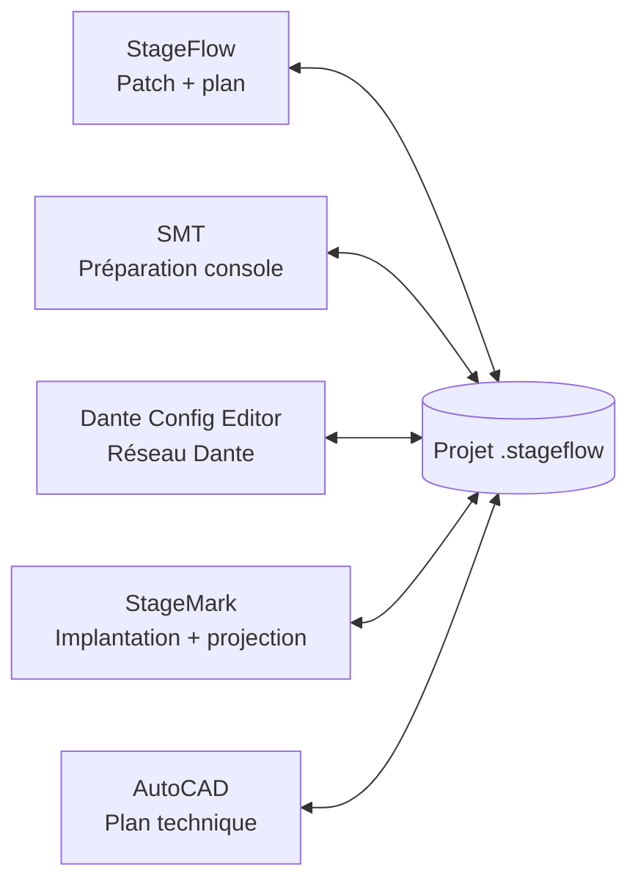

  

# SiLeMIO StageFlow — Téléchargement Windows

**StageFlow est gratuit.** Il permet de créer des patchs, gérer un patch commun
et des groupes, produire un classeur Excel A4, dessiner un plan de scène et
partager le même projet avec SMT, Dante Config Editor, StageMark et AutoCAD.

Il fonctionne également seul, hors ligne, en français et en anglais. Les
autres logiciels de la suite restent autonomes : tous savent travailler avec
le projet commun `.stageflow` sans exiger l’installation de StageFlow.

## Un seul projet, plusieurs outils

## Installation

1. Ouvrir la **dernière Release**.
2. Télécharger `SiLeMIO-StageFlow-Setup.exe` et
   `SiLeMIO-StageFlow-Setup.exe.sha256`.
3. Vérifier l’empreinte SHA-256, puis lancer l’installateur.
4. Laisser cochée l’option AutoCAD si le connecteur est souhaité.

**[Télécharger la dernière version](https://github.com/Mamat79/SiLeMIO-StageFlow-Distribution/releases/latest)**

Le connecteur AutoCAD 2026 ajoute l’onglet **SILEMI/O** et le bouton
**Patch StageFlow**. Aucun composant Autodesk n’est redistribué.

## English

StageFlow is a free, offline-friendly Windows application for patch lists,
group-specific A4 Excel workbooks and simple stage plans. It can share the same
native `.stageflow` project with SMT, Dante Config Editor, StageMark and the
optional AutoCAD 2026 connector. Every suite application remains standalone.

The diagram above is the product promise: one shared project, any combination
of standalone tools.

This public repository contains distribution files only. The source code is
maintained in a separate private repository.

---

<strong>SiLeMIO · By Mamat----[]---</strong>

